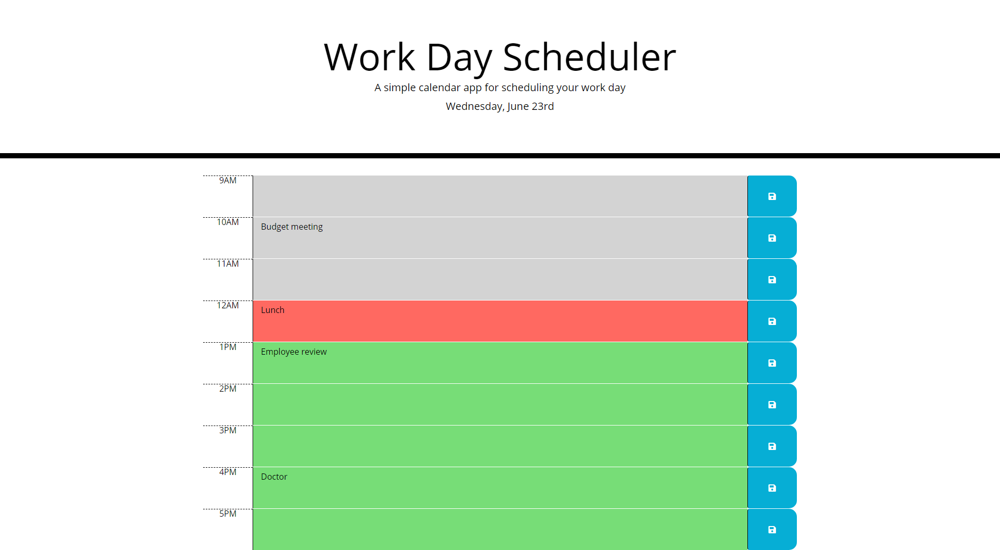

# Work Day Scheduler

## Description
This project is a work day event scheduler. It was created using `HTML`, `CSS`, `JavaScript`, `jQuery`, and `Moment.js`.

The application determines the current day of the week and date, and displays them under the title.

It also uses the current time to determine the background colors for each hour. Hours that have passed are displayed with a gray background, the current hour has a pink background, and future hours have a green background.

When you select a row, type in an event, and press the save button, the event is saved to local storage, and will remain visible even after a refresh.

## Page Link
The project can be viewed at <https://tharveyster.github.io/work-day-scheduler/>.

## Screen Shot

## License
MIT License

Copyright 2021 Todd Harvey

Permission is hereby granted, free of charge, to any person obtaining a copy of this software and associated documentation files (the "Software"), to deal in the Software without restriction, including without limitation the rights to use, copy, modify, merge, publish, distribute, sublicense, and/or sell copies of the Software, and to permit persons to whom the Software is furnished to do so, subject to the following conditions:

The above copyright notice and this permission notice shall be included in all copies or substantial portions of the Software.

THE SOFTWARE IS PROVIDED "AS IS", WITHOUT WARRANTY OF ANY KIND, EXPRESS OR IMPLIED, INCLUDING BUT NOT LIMITED TO THE WARRANTIES OF MERCHANTABILITY, FITNESS FOR A PARTICULAR PURPOSE AND NONINFRINGEMENT. IN NO EVENT SHALL THE AUTHORS OR COPYRIGHT HOLDERS BE LIABLE FOR ANY CLAIM, DAMAGES OR OTHER LIABILITY, WHETHER IN AN ACTION OF CONTRACT, TORT OR OTHERWISE, ARISING FROM, OUT OF OR IN CONNECTION WITH THE SOFTWARE OR THE USE OR OTHER DEALINGS IN THE SOFTWARE.

## Contact Info
Email: todd@theharveysplace.com
